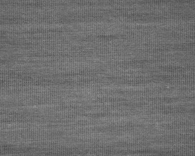
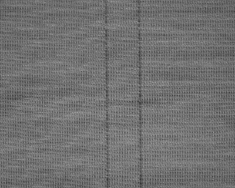
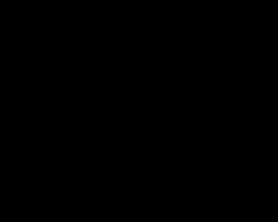
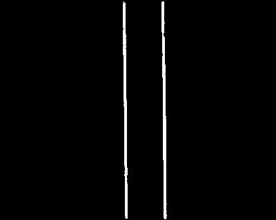

# Fabric Segmentation
Implement segmentation on knitted fabric by neural network

## Overview
### Data
Use knitted fabric images data collected from fabric factory for this project. 
There are two different patterns in fabric images. 
One without defects is called as normal pattern. 
The other one with two vertical lines defects is called as cutline:

Each image shape = (320, 400)

### Main Purpose
Use neural network to divide each pixel into cutline or normal pattern.

## Model
### Architecture
Modify our NN architecture from Unet to fit the complexity of fabric images. 
The original Unet architecture:

Our model's architecture can be referred in main.py

### Taining
number of knitted fabric images: 15
epochs: 100
batch_size: 8
validation_split: 0.1
optimizer: Adam(learning_rate:0.0001)
loss function: binary_crossentropy

### Testing
Use testing dataset to evaluate our model.
Set pixel threshold to 0.4.
If segmentation result of pixel > 0.4, classify the pixel as cutline. 
(Set to white for visualization)
Others will be classify as normal pattern.
(Set to black for visualization)

### Result

